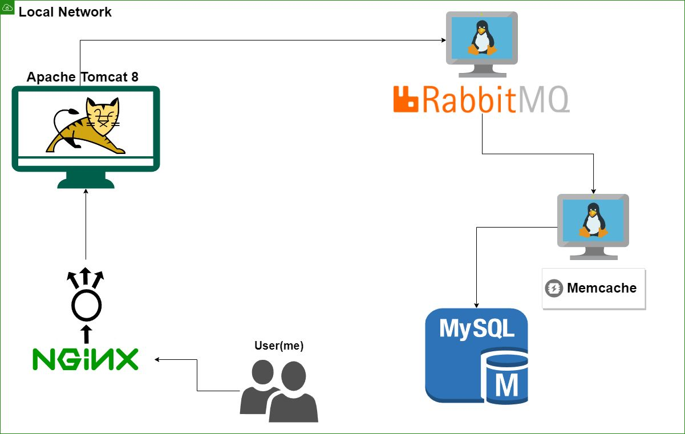
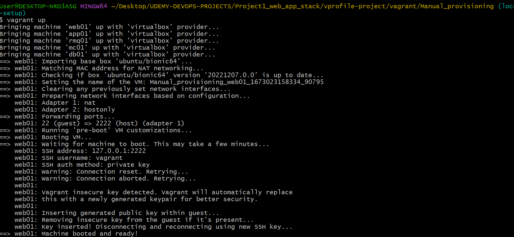
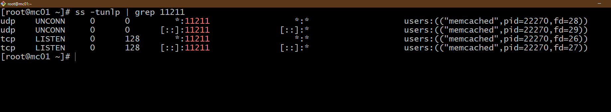
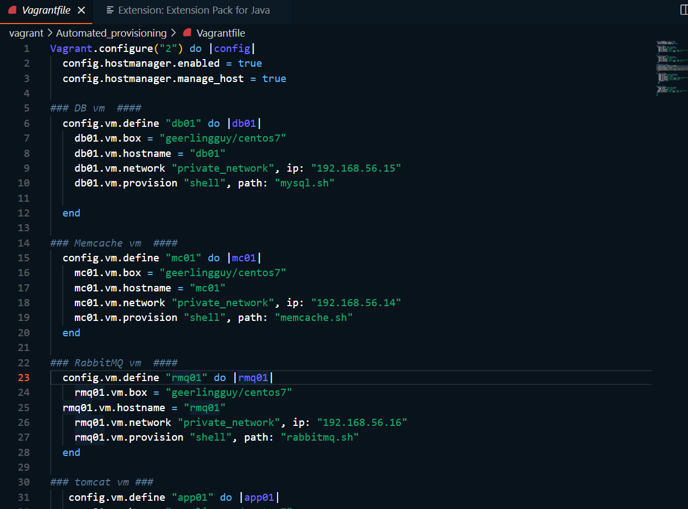

# Vprofile Project Setup

# PROJECT 1 :

## OBJECTIVE: VM automation locally

create local set up 
* automated
* repeatable
* IAC 
  
TOOLS:
* need VM / hypervisor - Virtual box
* automation - use vagrant
* CLI - GITBASH
* IDE - VSCode

### ARCHITECTURE:
- NGINX - open source software for web serving, reverse proxying, caching, load balancing, media streaming, and more.
- TOMCAT - Apache Tomcat is a web container. It allows the users to run Servlet and JAVA Server Pages that are based on the web-applications.
- RABBITMQ - Queing service
- MEMCACHED - in-memory data storage
- MYSQL - RDBMS

SUMMARY: manually set up: vagrant create VM automatically on Virtual box
then logged into each machine and ran shell commands and set up services.

Once stack ready, verified as user from browser, accessed nginx service then fowrad request to tomcat server then fowrard to message broker RABBITMQ, then to memcachD, then mysql server. Query got executed on tomcat, then cached to memcache server

### FLOW OF STACK
"collection of services working together to put togehter experience"

* user opens up browser enters IP address of load balancer
* NGINX - web application service / used to create load balancing experience > 
* when request comes, it routes request to TOMCAT service (APACHE TOMCAT - Java webapplication service)
 
- user login stored in MYSQL DB
- RABBIT MQ - message broker (aka queing agent)
- web application stored on apache tomcat 
- memcache - db caching
- mqsql stores request in memcached famous DB service

### AUTOMATION STACK
- VAGRANT - automate create VM machine from virtual box
- Virtual box
- BASH - set up services

#### STEP 1: 
> vagrant file uses file to launch 5 Virtual machine
- NGINX
- TOMCAT
- RABBITMQ
- MEMCACHED
- DB machine

> need to install vagrant plugin before bringing up VM:
"vagrant plugin install vagrant-hostmanager"

#### STEP 2: Spin up Virtual Machines
> command - "Vagrant up" (Turns on all VM)
* spins up VM through vagarnt file
* takes a while to spin up all VM
* can see VM in Virtual box manager 

#### STEP3: Confirm VM up/pinging/check /etc/hosts file

1) I then SSH into web01 "vagrant ssh web01"
2) cat /etc/hosts - check etc/host file - updates
3) able to successfully ping app01
4) ssh into app01

#### STEP 4: Provisioning
1) Set up MySQL - login to db01 (MySQL server)
2) update all machines on 
3) save password variable for db - DATABASE='admin123' in /etc/profile file 
4) source /etc/profile (makes permanant
5) install epel-release repo 
6) yum install git mariadb-server
7) systemctl start/enable mariadb (ensure starts on boot)
8) mysql_secure_installation - set up mariadb / set password
9) mysql -u root -p (login)
10) clone sourcecode from repo for sql file in resources dir - 'git clone https://github.com/devopshydclub/vprofile-project.git'
11) set up database - mysql -u root -p "$DATABASE_PASS" -e "create database accounts"
12) add user in sql named 'admin' - admin can gain access to app01
13) login into db - execude db_backup.sql file to accounts db -- mysql -u root -p"$DATABASE_PASS" accounts < src/main/resources/db_backup.sql
14) mysql -u root -p"DATABASE_PASS" -e "FLUSH PRIVILEGES"
15) login in mysql/maria db - confirm have DB
16) show accounts - initializes db

### STEP 5: set up memcached server
1) login into md01
2) yum install epel- release & memcached
3) systemctl start memcached / enable
4) memcached -p 11211 -u 11111 -u memcached -d (allows to listen to port )

1) ss -tunlp | grep 11211 - confirm memcache port is open on 11211

### STEP 6: login into Rabbit MQ - set up server
1) login to rmq (rabbit MQ server) / yum update
2) wget install erlang & socat dependencies
3) install Rabbitmq server using curl shell script
4) script run, install rabbitmq server package / install and enable server
5) configuration setting change to RMQ -
<code> sudo sh -c 'echo "[{rabbit, [{loopback_users, []}]}]." > /etc/rabbitmq/rabbitmq.config'</code>
6) create user - #sudo rabbitmqctl add_user test test
7) set user tag - sudo rabbitmqctl set_user_tags test administrator
8) bounce rabbitmq server - systemctl restart rabbitmq-server
9) Enabling the firewall and allowing port 25672 to access the rabbitmq permanently

### STEP 7 : TOMCAT SETUP
1) ssh into app01 server - Tomcat VM
2) update / set repositiory epel-release
3) install yum install java-1.8.0-openjdk
4) install git mavent wget
5) nav to /tmp folde - download tomcat package
6) extract tomcat package
7) create user for tomcat and home dir (copy all tomcat binaries) /usr/local/tomcat8

1) change ownership to tomcat user > "chown tomcat.tomcat /usr/local/tomcat8 -R (everything owner by tomcat user)
2) Setup systemd for tomcat
> update file with content : 
 
<code>[Unit]
Description=Tomcat
After=network.target
[Service]
User=tomcat
WorkingDirectory=/usr/local/tomcat8
Environment=JRE_HOME=/usr/lib/jvm/jre
Environment=JAVA_HOME=/usr/lib/jvm/jre
Environment=CATALINA_HOME=/usr/local/tomcat8
Environment=CATALINE_BASE=/usr/local/tomcat8
ExecStart=/usr/local/tomcat8/bin/catalina.sh run
ExecStop=/usr/local/tomcat8/bin/shutdown.sh
SyslogIdentifier=tomcat-%i
[Install]
WantedBy=multi-user.target
* This runs this bash script upon boot up of tomcat*
</code>
1)  systemctl daemon-reload (this saves any changes to service files)
2)  systemctl enable tomcat

### STEP : CODEBUILD & DEPLOY (app01)
1) git clone -b local-setup https://github.com/devopshydclub/vprofile-project.git
2) vi src/main/resources/application.properties - *VERY IMPORTANT CONFIG FILE - changes for any username/pass for other servers
3) Build code (artifact) inside repo (vprofile-project) - 'mvn install'
4) Deploy artifact
5) copy artifact into tomcat root folder 
6) start tomcat - systemctl start tomcat (application set to default tomcat app)

### SETUP NGINX server - web01
1) sudo apt-get nginx
2) create config file - used to redirect requests from nygynx to tomcat (act like load balancer)
3) delete default nginx config file
4) Create link to new config file - ln -s | (enables site)
5) restart nginx

RECAP:
* set up tools
* clone source code
* set up all services : mysql, memcached, tomcat, nginx, app build and deploy

#### Verify website from browser
1) ifconfig - 192.168.56.11 - login
2) confirmed NGINX server, able to log into service - DB confirms it is working
3) destroy stack 

### NOW AUTOMATE SETUP:
#### I have automated local set up, so its :
* repeatable
* automated
* IaaC 

1) Vagrant file has shell script files that will execute to initialize services: 
* mysql.bash - will automatically create DB, initialize DB, take care of  firewall rules 
* Then set up memcache services - centos7 "memcache.sh" - install memache, and check up and running 
* then rabbit mq 
* then tomcat - will also set up application / build and deploy - isntalls dependencies - jdk, tomcat/ copy artifact
 - tomcat shell script will copy application.properties file
* Then NGINX 
* IMPORTANT* - copy application.properties file -- every file will be syncd with vagrant/application.properties
* need to make sure application.properties need to ensure backend config info is correct*

1) Vagrant up - VM are up 
2) Validated that it works
3) run 'Vagrant halt' powers off stack
4) Vagrant does provisioning once, when created / when 'vagrant up' will bring VM's back on

