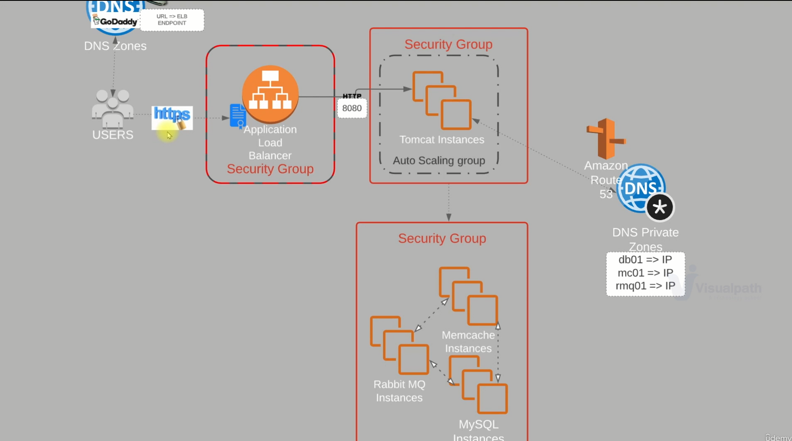
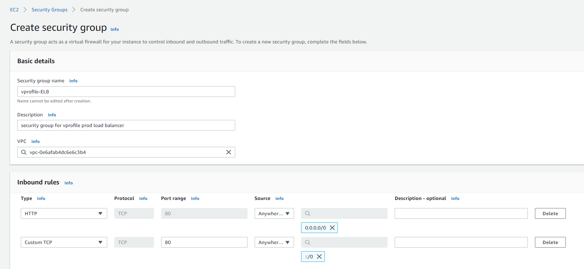
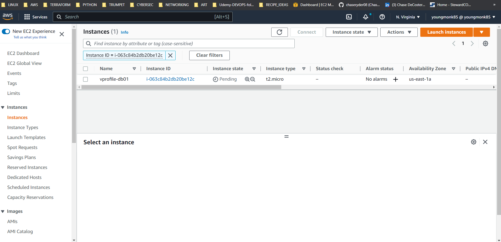
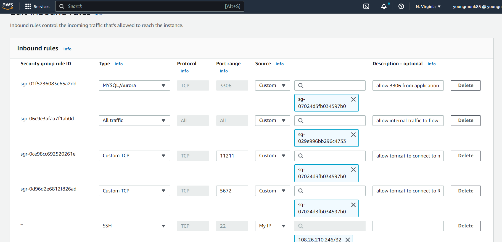
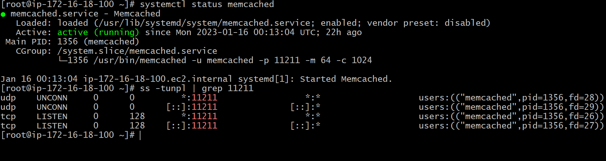
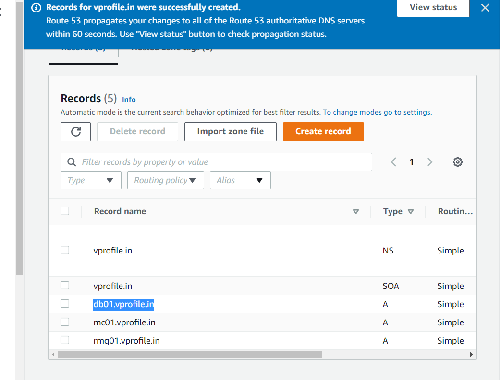
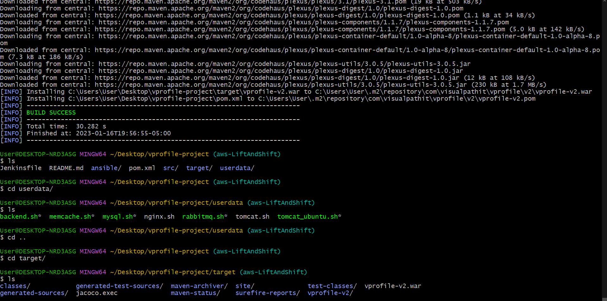
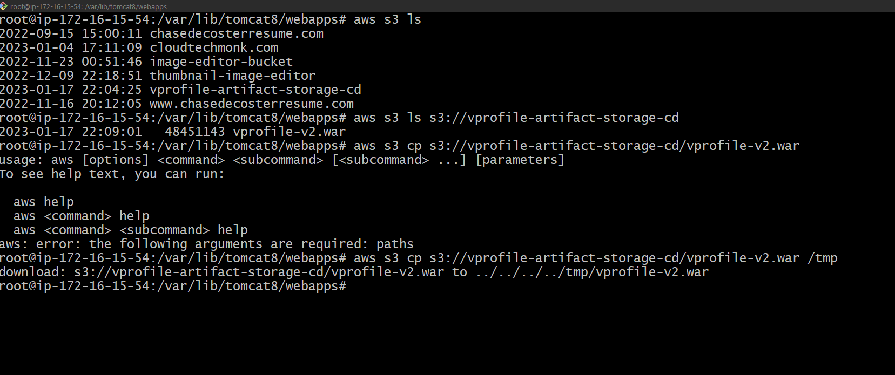

## PROJECT 2: LIFT & SHIFT APPLICATION WORKLOAD

* multi-tier web app stack using Vagrant
* will host and run on AWS Cloud
* LIFT AND SHIFT STRATEGY

### CONCEPT:
* application services on servers/VM (postgres, DNS, etc)
* Have work load in datacenter
* lots of servers running locally

### PROBLEM:
* need Virtualization team, DC OPS Monitoring, System admin team
* complex if need to scale up/down
* upfront use cost and maintenance cost
* most processes will be manual, but diff to automate
* very time consuming
  
### SOLUTION:
#### Cloud set up 
* benefits : pay as you go, IAAS, flexibility
* easy to manage
* we can automate to remove human errors
* save costs/time
  
### SERVICES:
* AWS ACM - 'https connection'
* EC2 instances - for Tomcat instances / RabbitMQ, Memcache, Mysql
* ELB load balance
* autoscaling group for Tomcat ec2 instances
* S3 storage - store software artifacts
* route 53 - DNS private zones
* separat security groups for ELB, Tomcat

### Benefits: 
1) flexible infrastucture 
2) no upfront cost
3) modernize effectiveley
4)  IAAC

### WORK FLOW:
1) login AWS
2) create key pairs
3) create security groups
4) launch ec2 isntances w/ user data [bash scripts]
5) update ip to name mpapping with route 53
6) build application from source code
7) upload artifact to S3 bucket
8) setup ELB w/ https connection
9) map elb endpoint to DNS
10) verify

## STEP 1: Create Security group

1) Create security group for ELB (allow HTTP (80) and HTTPS (443) for IPv4 and IPv6)
2) Create SG for Tomcat - (allow traffic from ELB)
3) Create SG for backend :

* Open port 3306 - allow tomcat to connect to DB
* Open port 11211 - allow tomcat to connect ot memcache
* open port 5672 allow tomcat to connect to RabbitMQ
* Allow internal traffic to flow on ports
</ui>
4) Create keypair 

### STEP 2: Provision services

1) Launch DB01 instance 
- spin up Centos7 from AWS marketplace
- input userdata from mysql.bash 
- security group - SG-backend'
- edit inbound SG rules to allow SSH port 22 from my IP address*

2) Launch RabbitMq server - confirm
3) Launch memcached server - confirm up and running in right port 
</img>

#### Confirmed back end stack is set up and running 

1) Copied IP address for 3 servers
2) created private hosted zone for back end servers
3) Created A Records for all three servers, named to IP mapping which will be used by Tomcat EC2 instance (use these names instead of IP addresses)

4) Launched Tomcat EC2 server

### STEP 3: Create Artifact store on AWS S3

1) Generate artifact - mvn install
2) Build successful - created target folder, and artifact
3) awscli installed on local computer
4) add new S3 user on IAM / download access key/credential file
5) Created new IAM role to provide S3FullAccess policy for app01 Instance. Provides EC2 access to S3 bucket.
6) Added SSH permission to app01 instance - ssh into machine
7) install awscli, copy artifact to app01 machine

1) Copy artifact to /var/lib/tomcat8/webbaps/ROOT.war - becomes default application
2) systemctl start tomcat8 service 
3)  Confirm extracted root directory/artifact and application.properites file

### STEP 4: Create Elastic Load Balancer
1) Create new subnet in US-east-1b
2) create private target group
3) create load balancer
* port 80 and 443 sending traffic to target group
* select ACM - cloudtechmonk.com (This was previously created for domain name - using this for educational purposes at this time)

4) Copy endpoint/dns name, and add C NAME record to DNS Route 53

### STEP 5: ALB
1) STILL NEED TO DO*

SUMMARY:
1) User access app through URL that points to load balancer end point
2) HTTPS connection, access ALB endpoint, certificate in ACM, application load balancer in Security group that only allows HTTPs 443 traffic
3) Forwards traffic to Tomcat EC2 instance on port 808 in different security group
4) Back end servers access in separate security group (memcache, Mysql RabbitMQ), 
5) When want can upload new artifcat to S3 bucket and then download to Tomcat EC2 instances.
