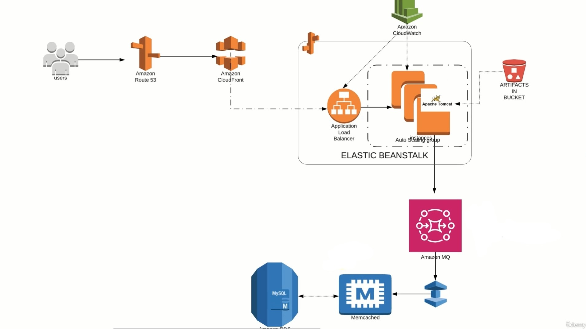
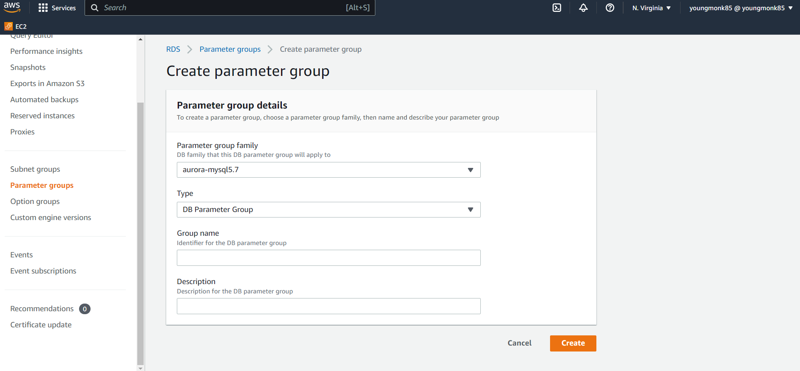
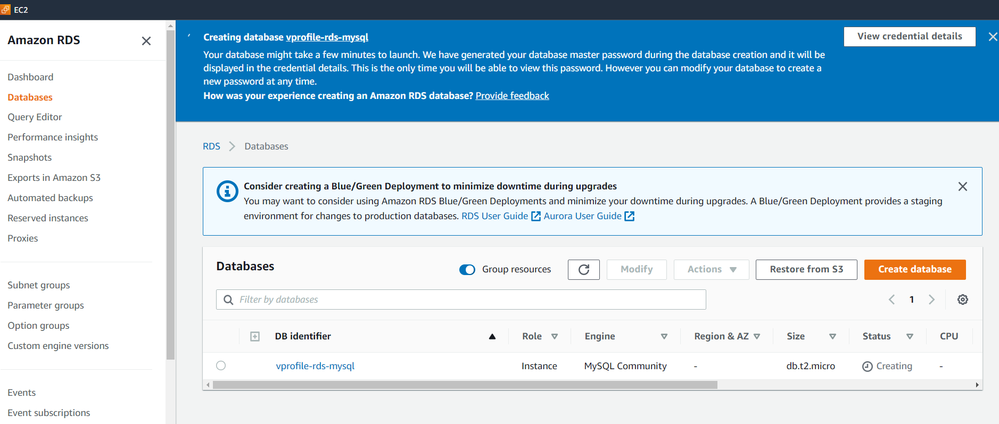
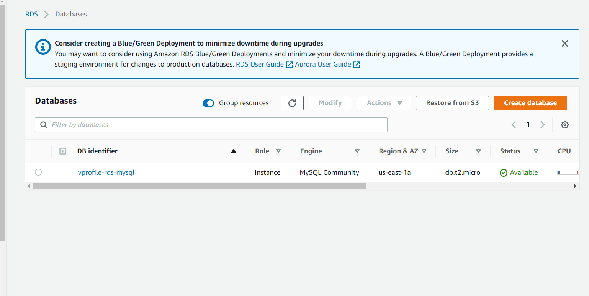
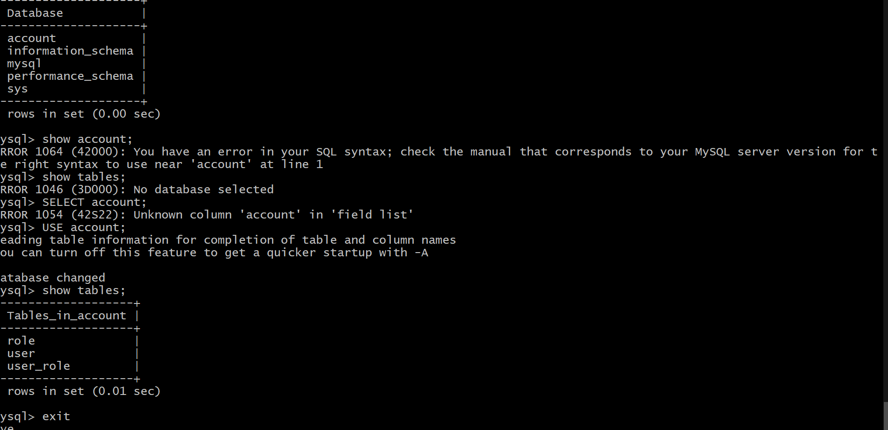

# PROJECT 3: REFACTORING WITH AWS
</img>
- Refactoring/Rearchitecture our services :
- Architecture to boost agility or improve business continuity : (allows to add new features, and give us good performance for your application workload)

## AWS SERVICES: 
Frontend: managed by Beanstalk*
- Beanstalk - EC2 instance for Tomcat (app service)
- beanstack will have NGINX LB
- automation for VM Scaling
- and S3 storage for artifacts

BACKEND: 
- RDS Instance - Database
- Elasticache instead of memache
- Active MQ instead of rabbitMQ
- route53 for DNS
- Route53 for content delivery

## PAAS and SAAS services for no operational overhead*
- EC2 
- Cloudwatch
- ELB
- Autoscaling
- EFS/S3
- RDS
- Elasticache
- activeMq
- route53
- cloudfront

### STEP 1: 
1) Create key pair for beanstalk 
2) Create security group for back end to allow all traffic within instance

### STEP 2: Create backend services : RDS

1) Create DB Subnet group
2) Create Parameter group 
   - using mysql5.7
   - left db settings to default
3) Create MySQL RDS Instance - free tier 
   - user: admin pass: Vib9qeabEbuQOOOefOOG
</img>

### STEP 3: Create ELasticache instance
1) Create Elasticache instance - in memory cache
   - create parameter group, subnet group
2) Create memached cluster

### STEP 4: Create Amazon MQ (RabbitMQ)
1) Create instance - free tier micro3
2) Set as private access - privately accessing RMQ

</img>

3) Create temporary EC2 to initialize DB the terminate
4) login into machine - install mysql-client
5) access mysql - show databases;
6) git clone source code - https://github.com/devopshydclub/vprofile-project.git on machine
7) shift to git branch aws-Refactor 
8) Initalized DB with schema | Confirmed 3 tables created 
- confirms RDS initialized
9) Grab details of back end services - including endpoints, port numbers

### STEP 5: Create Elastic Beanstalk
1) Create Elastic Beanstalk instance where hosting application
2) Set up Beanstalk enviornment for Tomcat (can create multiple environments in an application (docker, Tomtcat, etc...*)
3) Create EBS Application - sample for now
4) Put instance in ALB-SG, will create new SG for load balancer.
5) Create ELB - takes much time, creates application. 
