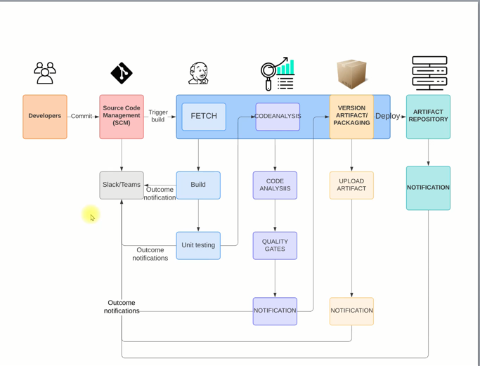

# Project 5: Jenkins CI and Tools

## Problems
- Agile SDLC
- regular code changes everyday, code needs to be tested regularly
- devopers need to fix bugs as they come / delays process
- manual, time consuming

## FIX
- build and test for every commit
- automated build and release process
- if build fail, devs will get notification - first fix code

## SOLUTION
### CONTINOUS INTEGRATION!
- many tools paired together to automate the process

## PRO:
- short time to repair
- fault isolation
- agile
- fast turn around time

## CREATE CI PIPELINE
## TOOLS: and sidekicks
- Jenkins - CI server
- GIT - Version control system
- Maven - build tool
- Checkstyle - code analysis tool
- Slack - notification / emails too
- Nexus - artifact software repository
- SonarQube - code analysis server
- AWS EC2 - computer resource / Jenkinks, nexus, solarqube

### PROCESS:
1) Devs commit code to GIT
2) Jenkins triggers build - fetch code > build > unit testing > return outncome to SLACK CHANNEL
3) Run code analysis - quality gates if threshold is passing
4) Software built > packaged > artifact will be uploaded > notification will be sent
5) Artifact stored in artifact repository