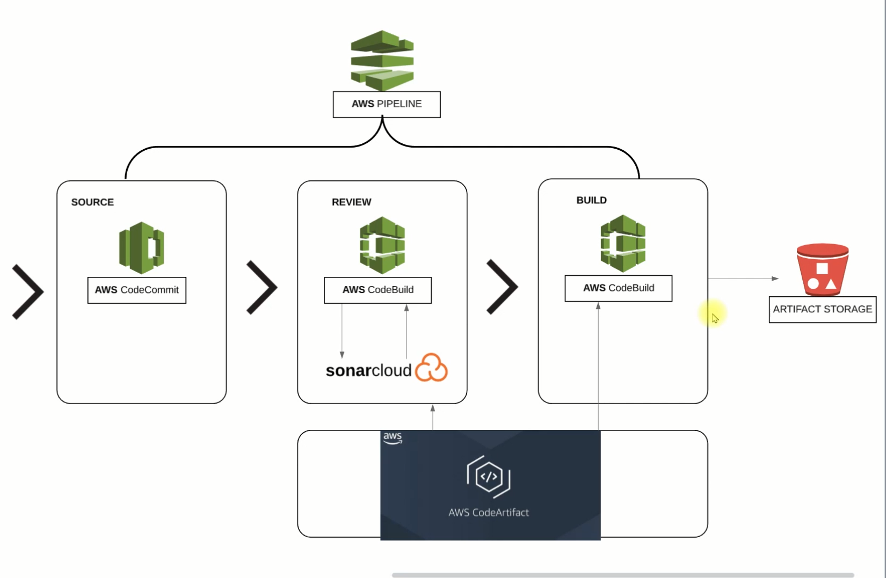
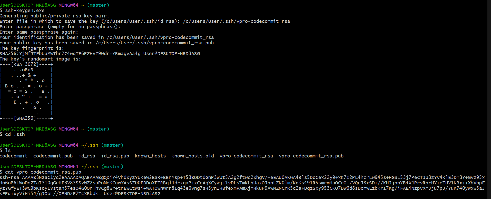
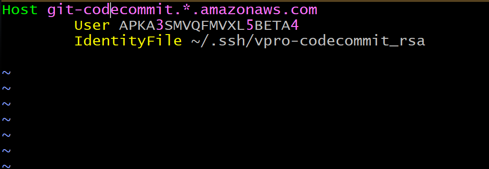
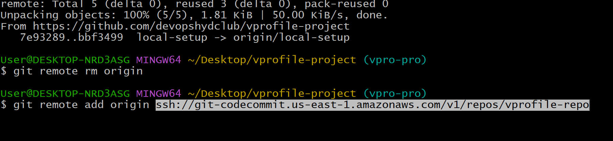
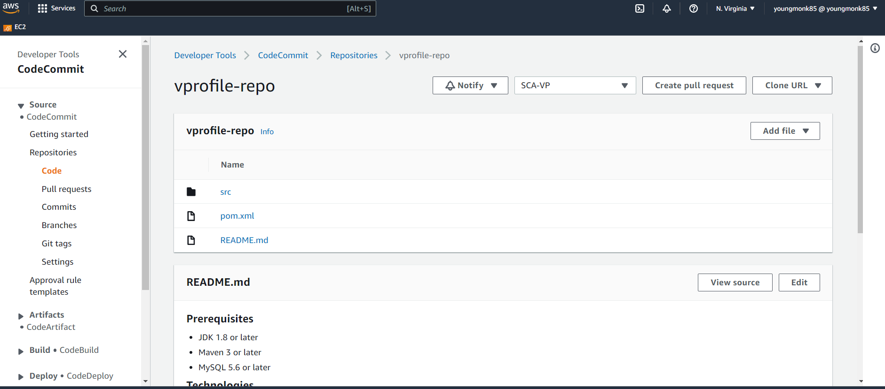
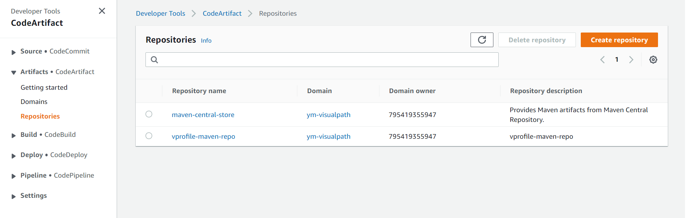
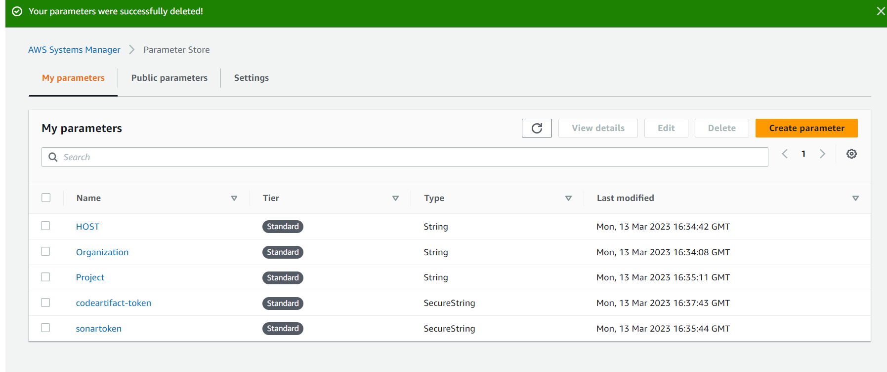

# Project 7: Continuous Integration on AWS

> Agile team makes regular code changes daily; code needs to be tested as it's what creating product
- usually have build/release team to do job
- time consuming for team to fix bugs
- need to fix bugs frequently

## FIX:
- need automated build/release test process
- developers need to be notified immediately if code isn't passing QUALITY GATES/ or any error - need to fix code!
### THIS IS CI PROCESS!
/
- need to build CI pipeline 
> results in shorter MTTR
> agile/ no human interverntion
> no operational overhead

## AWS SERVICES:
1) Code commit - VCS
2) Code Artifact - Maven download dependencies from repo
3) Code build - to build service
4) Code deploy - deploy code to S3
5) Sonar Cloud - SonarQube cloud based tool
6) Checkstyle - code analysis

# STEPS OF ARCHITECTURE:
1) code pushed/change to Codecommit from dev (like github)
2) Code build job triggered - SonarScanner will be triggered
3) download dependencies form AWS Codeartifact

///

## STEP 1: CodeCommit
1) Create codecommit repo
2) Create codecommit user 
3) create policy with all code commit privilege
4) Create/generate ssh key from local machine

5) Create ssh config file, codecommit will use this config file to access 

## STEP 2: clone sourcecode to codecommit
1) clone repo from github, and push to codecommit

## STEP 3: Create CodeArtifact:

- create repository which used for Maven build job and download dependencies
1) create IAM user admin for codeartifact
2) set up local awscli credentials with code-artifact user
3) change pom/settings.xml file with proper url information
4) Sonarcloud.io (similar to sonarqube) -- generate token, start new project
5) Parameter store - create parameters

6) Add sonar policy on IAM role gives privladges to use SSM Parameter Store*, which is needed for build job